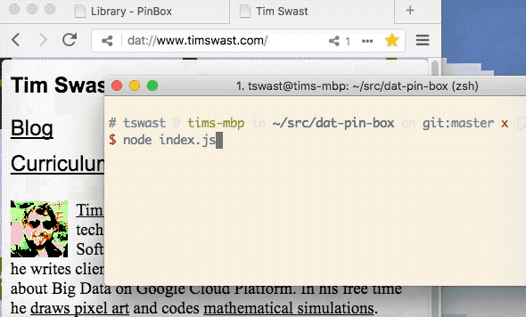

# dat-pin-box

Pin Dat repos by watching a Dat repo.

## Screenshots



## Instructions

1. Clone this repo.
1. `cd dat-pin-box && npm install`
1. Make an editable copy of a public pins list
   (dat://464b000900de29e2f02e1c304abb70de0a94266cae55a5ca94bf1abae78839b6/)
   in Beaker Browser.
1. Edit `pins.json`. Each element of the archives array should be a map with a `url` (to the dat repo) and a `directory` key (for a more human-friendly name of the directory).
1. Create a `pins/` directory on your pins box to store your pins.
1. Clone your pins dat on your pins box.

   `dat clone dat://yourpinsrepo/ pins/pins`

1. Run the dat-pin-box command.

   `node index.js pins/`

## Example pins.json

```
{
  "archives": [
    {
      "url": "dat://06ba272308751a7f0dfabce7f48df5a0f3954c5022d0cdc374ad1bbfcc56f4f7",
      "directory": "www.timswast.com"
    },
    {
      "url": "dat://66f88da36301949f971acce0383593d4c747e7b7a66d010478ca4412415f5645",
      "directory": "fritter-tswast"
    }
  ]
}
```

## License

Released under Apache 2.0. See [LICENSE](LICENSE).

## Disclaimer

This is not an officially supported Google product.
